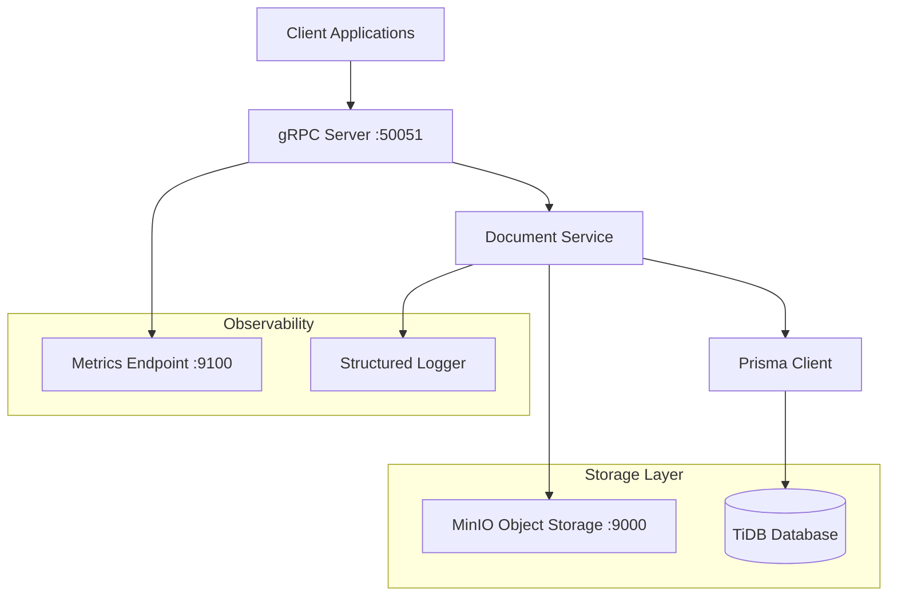

# User Document Storage Service Design

## Overview

The User Document Storage Service is a gRPC-based microservice that provides secure document storage and management capabilities for the LumenSlate AI platform. The service integrates MinIO for object storage and TiDB for metadata persistence, following the existing project's architecture patterns while migrating from SQLAlchemy to Prisma ORM for improved type safety and developer experience.

The service handles document upload, download, deletion, and usage tracking with comprehensive monitoring and observability features. It maintains consistency with the existing LumenSlate architecture by using gRPC-only APIs, structured logging, and environment-based configuration.

## Architecture

### High-Level Architecture



### Service Integration Points

The service integrates with the existing LumenSlate infrastructure:

- **gRPC Server**: Extends the existing `app/grpc_server.py` to include document service endpoints
- **Configuration**: Uses the existing `app/config/` pattern with environment-specific settings
- **Logging**: Leverages the existing structured logging configuration in `app/config/logging_config.py`
- **Database Migration**: Transitions from SQLAlchemy models to Prisma schema while maintaining data integrity

### Design Decisions

1. **Prisma ORM Migration**: Moving from SQLAlchemy to Prisma provides better type safety, improved developer experience, and more robust schema management. This aligns with modern development practices and reduces runtime errors.

2. **MinIO Integration**: Self-hosted object storage provides cost control and data sovereignty while maintaining S3-compatible APIs for future flexibility.

3. **Hierarchical Storage Structure**: The `documents/{user_id}/{category}/{date}/{filename}` pattern provides logical organization and supports future features like category-based permissions.

4. **Streaming Support**: gRPC streaming for large file operations ensures memory efficiency and better user experience for large documents.

## Components and Interfaces

### gRPC Service Definition

```protobuf
// app/protos/document_service.proto
syntax = "proto3";

package document;

service DocumentService {
  rpc UploadDocument(stream UploadDocumentRequest) returns (UploadDocumentResponse);
  rpc DownloadDocument(DownloadDocumentRequest) returns (stream DownloadDocumentResponse);
  rpc DeleteDocument(DeleteDocumentRequest) returns (DeleteDocumentResponse);
  rpc ListDocuments(ListDocumentsRequest) returns (ListDocumentsResponse);
  rpc GetDocumentUrl(GetDocumentUrlRequest) returns (GetDocumentUrlResponse);
  rpc GetUsageStats(GetUsageStatsRequest) returns (GetUsageStatsResponse);
}

message UploadDocumentRequest {
  oneof data {
    DocumentMetadata metadata = 1;
    bytes chunk = 2;
  }
}

message DocumentMetadata {
  string user_id = 1;
  string category = 2;
  string filename = 3;
  string mime_type = 4;
  int64 size = 5;
}

message DownloadDocumentRequest {
  string user_id = 1;
  string document_id = 2;
}

message ListDocumentsRequest {
  string user_id = 1;
  optional string category = 2;
  optional string date_filter = 3;
  int32 page_size = 4;
  string page_token = 5;
}
```

### Core Service Components

#### DocumentService Implementation
- **Location**: `app/services/document_service.py`
- **Responsibilities**: 
  - Coordinate between MinIO and database operations
  - Implement business logic for document operations
  - Handle streaming upload/download
  - Enforce quotas and validation rules

#### MinIO Client Wrapper
- **Location**: `app/utils/minio_client.py`
- **Responsibilities**:
  - Abstract MinIO operations following the open-source deployment guide
  - Handle bucket management and initialization
  - Generate presigned URLs with configurable expiry
  - Implement retry logic for network failures
  - Support multipart uploads for large files (>100MB)
  - Provide streaming upload/download capabilities
  - Leverage MinIO core features (S3 compatibility, versioning, encryption)

#### Prisma Database Client
- **Location**: `app/models/prisma/`
- **Responsibilities**:
  - Replace existing SQLAlchemy models
  - Provide type-safe database operations
  - Handle migrations and schema management

#### Metrics Collector
- **Location**: `app/utils/metrics_collector.py`
- **Responsibilities**:
  - Collect and aggregate operation metrics
  - Expose JSON metrics endpoint
  - Track per-user and global statistics

## Data Models

### Prisma Schema Definition

```prisma
// schema.prisma
generator client {
  provider = "prisma-client-py"
}

datasource db {
  provider = "mysql"
  url      = env("MICROSERVICE_DATABASE")
}

model Document {
  id        String   @id @default(uuid())
  status    Status   @default(PENDING)
  userId    String   @map("user_id")
  category  String
  filename  String
  path      String   @unique
  size      BigInt
  mimeType  String   @map("mime_type")
  createdAt DateTime @default(now()) @map("created_at")
  updatedAt DateTime @updatedAt @map("updated_at")
  
  @@map("rag_document")
  @@index([userId, category])
  @@index([createdAt])
}

model UserUsage {
  userId     String   @id @map("user_id")
  fileCount  Int      @default(0) @map("file_count")
  totalBytes BigInt   @default(0) @map("total_bytes")
  updatedAt  DateTime @updatedAt @map("updated_at")
  
  @@map("user_usage")
}

enum Status {
  PENDING
  COMPLETED
  FAILED
}
```

### Migration Strategy

1. **Schema Introspection**: Use `prisma db pull` to generate initial schema from existing SQLAlchemy tables
2. **Data Preservation**: Ensure all existing `RagDocument` records are preserved during migration
3. **Gradual Migration**: Implement dual-write pattern during transition period if needed
4. **Validation**: Compare data integrity before and after migration

## Error Handling

### Error Categories and Responses

#### Validation Errors
- **File Size Exceeded**: `INVALID_ARGUMENT` with size limit details
- **Invalid MIME Type**: `INVALID_ARGUMENT` with allowed types list
- **Missing Metadata**: `INVALID_ARGUMENT` with required fields

#### Resource Errors
- **Quota Exceeded**: `RESOURCE_EXHAUSTED` with current usage stats
- **Document Not Found**: `NOT_FOUND` with document ID
- **Duplicate Upload**: `ALREADY_EXISTS` with existing document info

#### Infrastructure Errors
- **MinIO Unavailable**: `UNAVAILABLE` with retry guidance
- **Database Connection**: `UNAVAILABLE` with service status
- **Network Timeout**: `DEADLINE_EXCEEDED` with operation context

### Error Handling Implementation

```python
# app/utils/error_handler.py
class DocumentServiceError(Exception):
    def __init__(self, code: grpc.StatusCode, message: str, details: dict = None):
        self.code = code
        self.message = message
        self.details = details or {}

class QuotaExceededError(DocumentServiceError):
    def __init__(self, current_usage: int, limit: int):
        super().__init__(
            grpc.StatusCode.RESOURCE_EXHAUSTED,
            f"Storage quota exceeded: {current_usage}/{limit} bytes",
            {"current_usage": current_usage, "limit": limit}
        )
```

### Retry and Circuit Breaker Patterns

- **MinIO Operations**: Exponential backoff with 3 retries
- **Database Operations**: Immediate retry for connection issues, circuit breaker for persistent failures
- **Streaming Operations**: Resume capability for large file transfers

## Testing Strategy

### Unit Testing

#### Service Layer Tests
- **Location**: `tests/services/test_document_service.py`
- **Coverage**: Business logic, validation rules, error handling
- **Mocking**: MinIO client, Prisma client, metrics collector

#### Integration Tests
- **Location**: `tests/integration/test_document_flow.py`
- **Coverage**: End-to-end document operations
- **Infrastructure**: TestContainers for MinIO and TiDB

#### gRPC Tests
- **Location**: `tests/grpc/test_document_grpc.py`
- **Coverage**: gRPC service methods, streaming operations
- **Tools**: grpcio-testing for service testing

### Performance Testing

#### Load Testing
- **Tool**: grpcurl with custom scripts
- **Scenarios**: 
  - Concurrent uploads (100 users, 10MB files)
  - Bulk downloads (50 concurrent streams)
  - Mixed operations (upload/download/list)

#### Stress Testing
- **Quota Limits**: Test behavior at 95% quota usage
- **Large Files**: 50MB file uploads/downloads
- **Database Load**: 1000+ documents per user

### Migration Testing

#### Data Integrity Tests
- **Pre-migration**: Snapshot existing SQLAlchemy data
- **Post-migration**: Verify all records migrated correctly
- **Functional**: Ensure all operations work with migrated data

#### Performance Comparison
- **Query Performance**: Compare SQLAlchemy vs Prisma query times
- **Memory Usage**: Monitor memory consumption during operations
- **Connection Pooling**: Verify efficient database connection usage

#### MinIO Integration Testing
- **Bucket Operations**: Test bucket creation, listing, and management
- **File Operations**: Upload, download, delete operations with various file sizes
- **Streaming**: Test streaming uploads/downloads for large files (>100MB)
- **Presigned URLs**: Verify URL generation and expiry handling
- **Error Handling**: Test MinIO unavailability scenarios
- **Performance**: Benchmark file operations under load
- **S3 Compatibility**: Validate S3 API compatibility with various clients
- **Console Access**: Verify MinIO console accessibility and functionality
- **Health Checks**: Test container health check endpoints

### Test Data Management

```python
# tests/fixtures/document_fixtures.py
@pytest.fixture
def sample_documents():
    return [
        {
            "user_id": "user123",
            "category": "reports",
            "filename": "test.pdf",
            "mime_type": "application/pdf",
            "size": 1024000
        }
    ]

@pytest.fixture
def minio_test_bucket():
    # Setup test bucket with cleanup
    pass
```

### Continuous Integration

- **Pre-commit Hooks**: Type checking, linting, basic tests
- **CI Pipeline**: Full test suite, integration tests, performance benchmarks
- **Migration Tests**: Automated testing of SQLAlchemy to Prisma migration

## Configuration and Deployment

### Environment Configuration

Following the existing LumenSlate pattern in `app/config/settings/`:

```python
# app/config/settings/document_service.py
from pydantic_settings import BaseSettings

class DocumentServiceSettings(BaseSettings):
    # MinIO Configuration (Self-Hosted Open Source)
    minio_endpoint: str = "localhost:9000"
    minio_access_key: str = "minioadmin"  # Maps to MINIO_ROOT_USER
    minio_secret_key: str = "minioadmin"  # Maps to MINIO_ROOT_PASSWORD
    minio_secure: bool = False
    minio_region: str = "us-east-1"
    minio_bucket: str = "documents"
    
    # Storage Backend Configuration
    storage_backend: str = "minio"
    storage_max_file_size: str = "50MB"
    storage_allowed_extensions: list[str] = ["pdf", "doc", "docx", "txt", "xlsx"]
    
    # Database Configuration
    microservice_database: str
    
    # Service Configuration
    max_file_size: int = 52428800  # 50MB
    allowed_mime_types: list[str] = [
        "application/pdf",
        "application/vnd.openxmlformats-officedocument.wordprocessingml.document",
        "application/vnd.openxmlformats-officedocument.spreadsheetml.sheet",
        "text/plain"
    ]
    
    # Quota Configuration
    default_user_quota: int = 1073741824  # 1GB
    
    # Monitoring
    metrics_port: int = 9100
    
    # MinIO Console
    minio_console_endpoint: str = "localhost:9001"
    
    class Config:
        env_file = ".env"
        
    @property
    def minio_client_config(self) -> dict:
        """MinIO client configuration dictionary"""
        return {
            "endpoint": self.minio_endpoint,
            "access_key": self.minio_access_key,
            "secret_key": self.minio_secret_key,
            "secure": self.minio_secure,
            "region": self.minio_region
        }
```

### Self-Hosted MinIO Setup

Following the official MinIO quickstart guide, the service uses a self-hosted open-source MinIO deployment:

#### MinIO Server Requirements
- **Version**: Latest stable MinIO image (minio/minio:latest)
- **Development**: 4GB RAM, 2 CPU cores, 100GB storage
- **Production**: 16GB+ RAM, 4+ CPU cores, 1TB+ storage (scalable)
- **Storage**: SSD/NVMe recommended for performance
- **Network**: 1Gbps+ network interface for high throughput
- **License**: GNU AGPL v3.0 (open source, no license file required)

#### Docker Compose Integration

```yaml
# docker-compose.yml (additions)
services:
  minio:
    image: minio/minio:latest
    container_name: lumenslate-minio
    ports:
      - "9000:9000"        # MinIO API
      - "9001:9001"        # MinIO Console
    environment:
      MINIO_ROOT_USER: ${MINIO_ROOT_USER:-minioadmin}
      MINIO_ROOT_PASSWORD: ${MINIO_ROOT_PASSWORD:-minioadmin}
    volumes:
      - minio_data:/data
    command: server /data --console-address ":9001"
    healthcheck:
      test: ["CMD", "curl", "-f", "http://localhost:9000/minio/health/live"]
      interval: 30s
      timeout: 10s
      retries: 3
    networks:
      - lumenslate-network
    restart: unless-stopped

  document-service:
    build: .
    ports:
      - "50051:50051"
      - "9100:9100"
    environment:
      - MINIO_ENDPOINT=minio:9000
      - MINIO_ACCESS_KEY=${MINIO_ROOT_USER:-minioadmin}
      - MINIO_SECRET_KEY=${MINIO_ROOT_PASSWORD:-minioadmin}
      - MINIO_SECURE=false
      - MINIO_REGION=${MINIO_REGION:-us-east-1}
      - MICROSERVICE_DATABASE=${MICROSERVICE_DATABASE}
      - STORAGE_BACKEND=minio
    depends_on:
      minio:
        condition: service_healthy
      tidb:
        condition: service_started
    networks:
      - lumenslate-network

volumes:
  minio_data:
    driver: local

networks:
  lumenslate-network:
    driver: bridge
```

#### MinIO Deployment Verification

After deployment, verify the MinIO server is running correctly:

1. **Check Container Logs**:
```bash
docker logs lumenslate-minio
```

2. **Access MinIO Console**:
   - Browser: `http://localhost:9001`
   - Default credentials: `minioadmin:minioadmin`

3. **Test API Connectivity**:
```bash
curl -f http://localhost:9000/minio/health/live
```

#### Core Features Available

With open-source MinIO deployment, the following features are available:
- **S3 API Compatibility**: Full compatibility with Amazon S3 APIs
- **High Performance**: Optimized for AI/ML and analytics workloads
- **Web Console**: Built-in web interface for bucket and object management
- **Versioning**: Object versioning support
- **Encryption**: Server-side encryption capabilities
- **Event Notifications**: Webhook and message queue integrations

#### Bucket Organization

The service creates and manages the following bucket structure:

- **`documents`**: Primary bucket for user document storage
  - Path structure: `documents/{user_id}/{category}/{date}/{filename}`
- **`temp`**: Temporary files during upload processing
- **`backups`**: Document metadata backups

#### MinIO Client Configuration

```python
# app/utils/minio_client.py
from minio import Minio
from minio.error import S3Error
import os
import logging

logger = logging.getLogger(__name__)

class MinIOClient:
    def __init__(self):
        self.client = Minio(
            endpoint=os.getenv("MINIO_ENDPOINT", "localhost:9000"),
            access_key=os.getenv("MINIO_ACCESS_KEY", "minioadmin"),
            secret_key=os.getenv("MINIO_SECRET_KEY", "minioadmin"),
            secure=os.getenv("MINIO_SECURE", "false").lower() == "true",
            region=os.getenv("MINIO_REGION", "us-east-1")
        )
        self.buckets = {
            "documents": "documents",
            "temp": "temp", 
            "backups": "backups"
        }
        
    async def ensure_buckets_exist(self):
        """Create required buckets if they don't exist"""
        try:
            for bucket_name in self.buckets.values():
                if not self.client.bucket_exists(bucket_name):
                    self.client.make_bucket(bucket_name)
                    logger.info(f"Created bucket: {bucket_name}")
                else:
                    logger.debug(f"Bucket already exists: {bucket_name}")
        except S3Error as e:
            logger.error(f"Failed to ensure buckets exist: {e}")
            raise
            
    async def verify_connection(self):
        """Verify MinIO server connectivity"""
        try:
            # Test basic connectivity
            buckets = self.client.list_buckets()
            logger.info(f"Successfully connected to MinIO. Found {len(buckets)} buckets.")
            return True
        except Exception as e:
            logger.error(f"Failed to connect to MinIO: {e}")
            return False
```

### Monitoring and Observability Integration

The service extends the existing LumenSlate logging and monitoring patterns:

```python
# app/utils/document_metrics.py
class DocumentMetrics:
    def __init__(self):
        self.counters = {
            "documents_upload_total": 0,
            "documents_download_total": 0,
            "documents_delete_total": 0,
            "documents_errors_total": 0,
            "documents_quota_exceeded_total": 0,
            "minio_unavailable_total": 0,
            "database_unavailable_total": 0,
            "documents_operation_failures_total": 0
        }
        self.gauges = {
            "documents_storage_bytes": {},  # per-user storage
            "documents_storage_bytes_total": 0
        }
```

This design maintains consistency with the existing LumenSlate architecture while introducing the new document storage capabilities through a clean migration from SQLAlchemy to Prisma ORM.